==========================================
Odoo Mexico Localization for Stock/Landing
==========================================

This module extends the functionality of Mexican localization to support customs numbers related with landed costs when you generate the electronic invoice.

Usage
=====

To use this module, you need to:

* Generate a new purchase order of a product from abroad. Landed costs are only possible for products configured in real time valuation with real price costing method. The costing method is configured on the product category

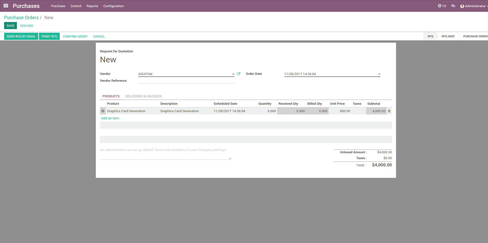

* Receive the product of the purchase order

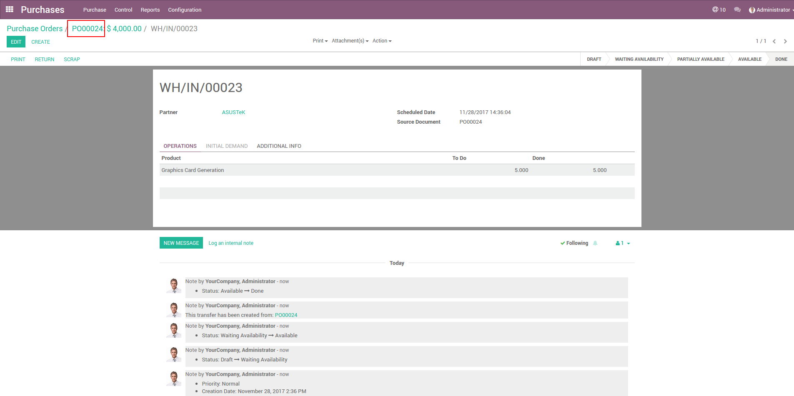

* Go to Inventory -> Inventory control -> Landed Cost

* Create a new landed cost indicating the picking of the purchase order and the number of the customs information (pedimento). Landed costs are only possible for products configured in real time valuation with real price costing method. The costing method is configured on the product category

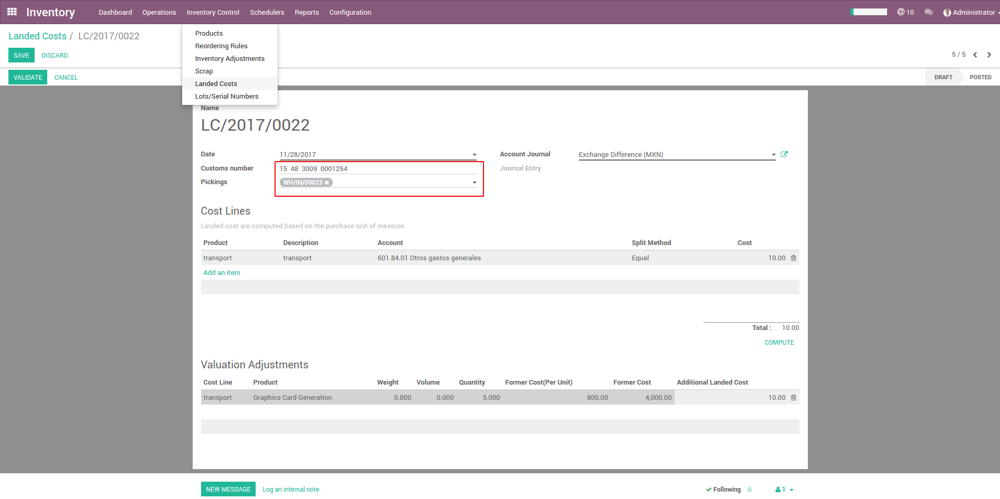

* Start by creating specific products to indicate your various Landed Costs, such as freight, insurance or custom duties.
  Go to Inventory -> Configuration -> Landed Cost types. Landed costs are only possible for products configured in real time valuation with real price costing method. The costing method is configured on the product category.

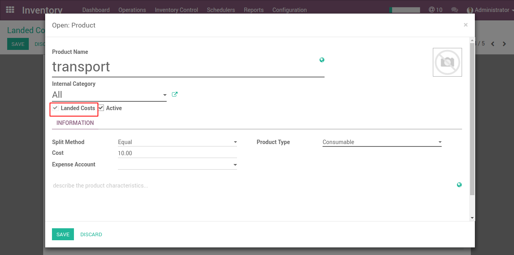

* Click the Compute button to see how the landed costs will be split across the picking lines.

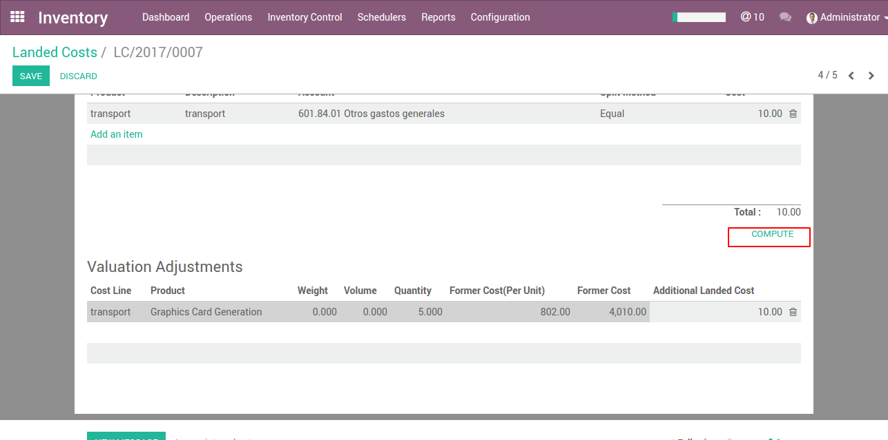

* To confirm the landed costs attribution, click on the Validate button.

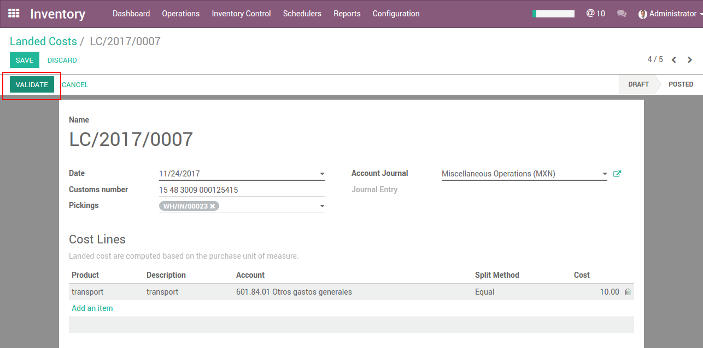

* Create a sales order for the product purchased from abroad

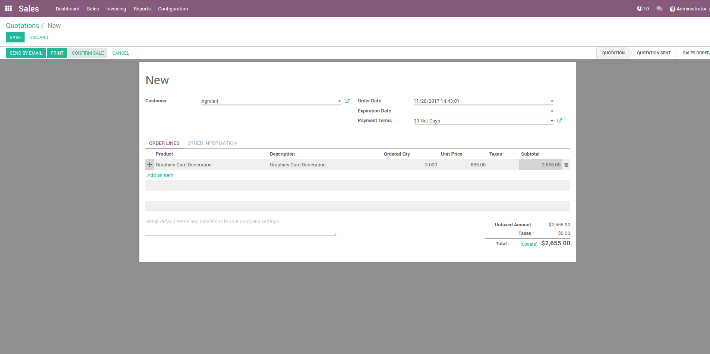

* Delivery the product related to the sales order

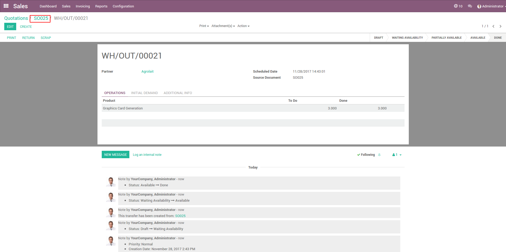

* Create and validate a new invoice associated with the sales order

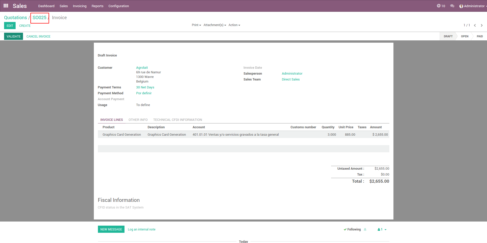

* The customs information is found in the lines of the invoice associated with each product.

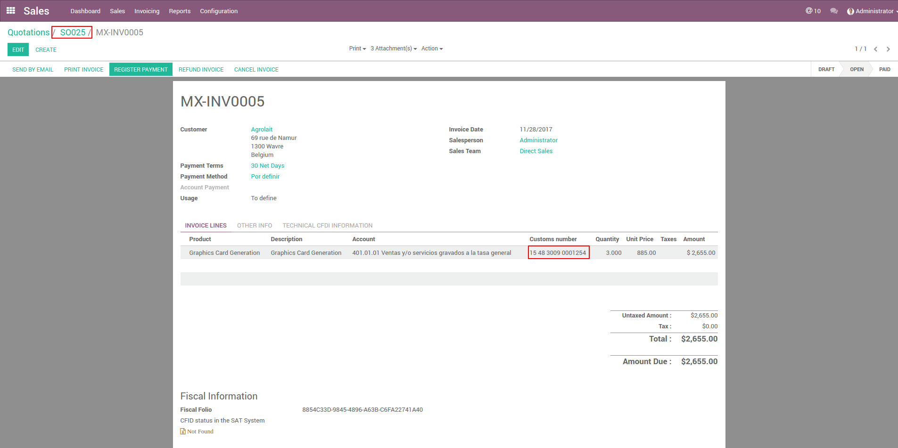

* Check the electronic invoice associated with the product where the node of the customs information is displayed

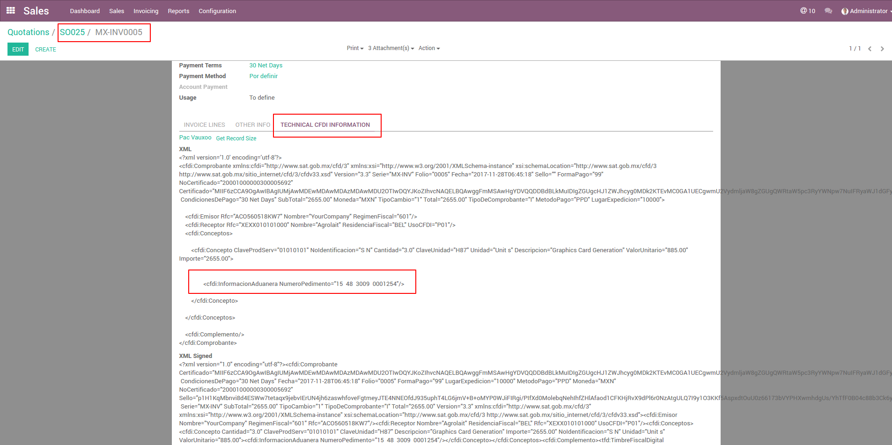

Credits
=======

* Jarsa Sistemas, Vauxoo

Contributors
------------

* Alan Ramos <alan.ramos@jarsa.com.mx>
* Miguel Ruiz <miguel.ruiz@jarsa.com.mx>
* Julio Serna <julio@vauxoo.com>
* Luis Torres <luis_t@vauxoo.com>
* Deivis Laya <deivis@vauxoo.com>

Do not contact contributors directly about support or help with technical issues.
